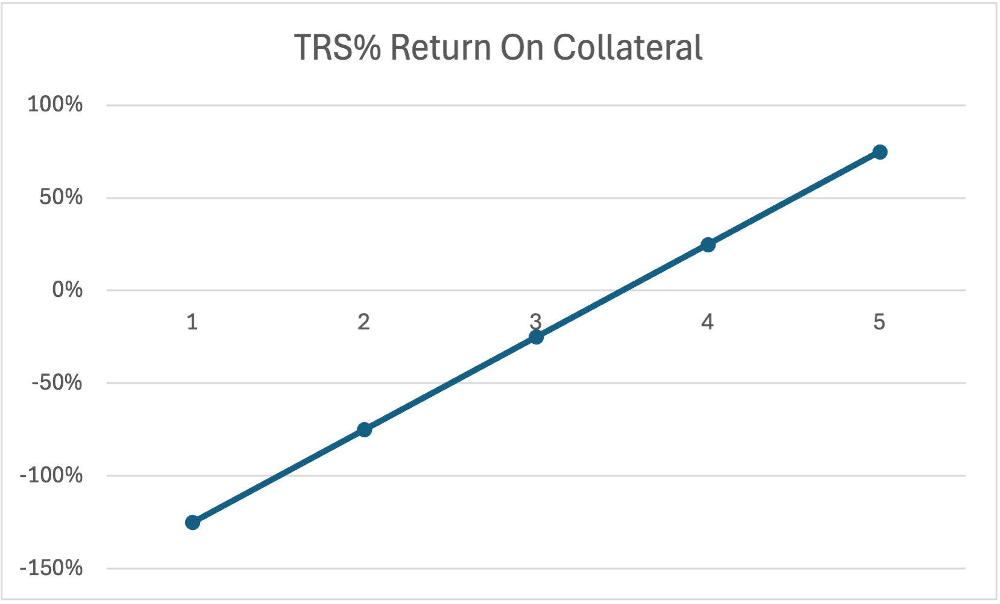
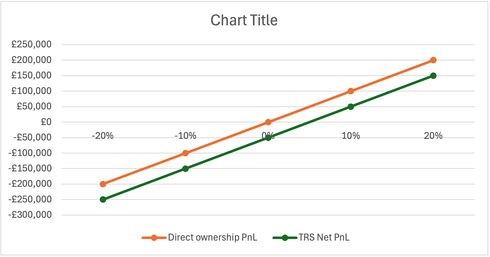

# Total Return Swaps (TRS) Case Study

## 📌 Overview
This project explores how hedge funds used **Total Return Swaps (TRS)** to avoid UK taxes, how regulators closed the loophole, and what risks swaps still create today.  

It includes:  
- **Report** (below in this README)  
- **Notes** (`/notes/rough-notes.md`)  
- **Excel/Python models** (`/model/`)  
- **Charts** (`/images/`)  
- **References** (`/references/`)  

---

## 1️⃣ Introduction
- What TRS are  
- Why hedge funds use them  
- How they can create both opportunities and risks  

---

## 2️⃣ The TRS Loophole
- How hedge funds used TRS to avoid taxes  
- Example of synthetic ownership without stamp duty  
- Why regulators saw it as unfair  

---

## 3️⃣ UK Law: Section 695A (Corporation Tax Act 2009)
- What the law says  
- How it closed the loophole  
- Impact on hedge fund strategies  

---

## 4️⃣ Real-World Case Studies
- Archegos Capital (2021): swaps and hidden leverage  
- Other hedge fund examples  

---

## 5️⃣ TRS Today
- How swaps are used in a compliant way (hedging, financing, leverage)  
- What changed after regulation  

---

## 6️⃣ Risks & Controls
- Hidden leverage and systemic risk  
- Risk controls: margin, collateral, reporting  
- Lessons for hedge funds and regulators  

---

## 7️⃣ Conclusion
- Summary of findings  
- Why TRS matter for markets and risk management  

---

## 📊 Model Findings

### Direct vs TRS PnL

### TRS Return on Collateral

 

---

## 🔁 Reproduce the Charts (Excel)
- Open `model/TRS_vs_Shares.xlsx`
- Change inputs (notional, financing, collateral) at the top
- Charts update automatically

---

## 📁 Project Files
- `README.md` – full write‑up
- `notes/rough-notes.md` – draft notes
- `model/TRS_vs_Shares.xlsx` – Excel model & charts
- `model/TRS_simulation.py` – Python simulator
- `images/` – exported charts (Excel + Python)
- `data/trs_results.csv` – simulation outputs
- `references/` – HMRC / legal references

---

## 📚 References
- HMRC TRS Guidance (`/references/`)  
- Corporation Tax Act 2009, Section 695A  
- Academic papers and industry reports  
